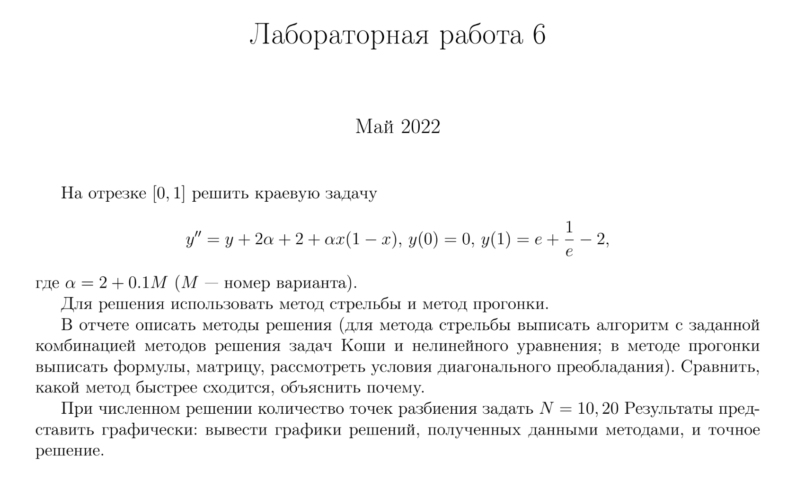
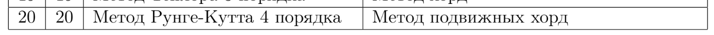
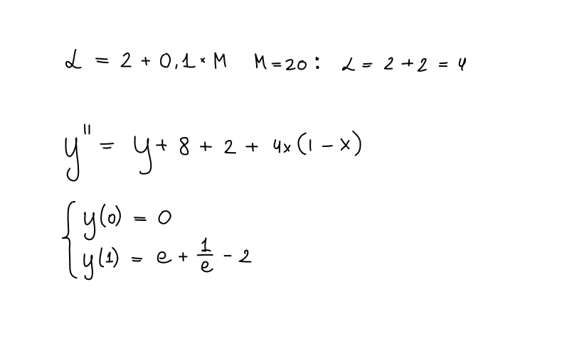
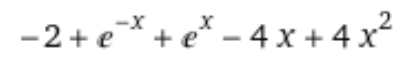
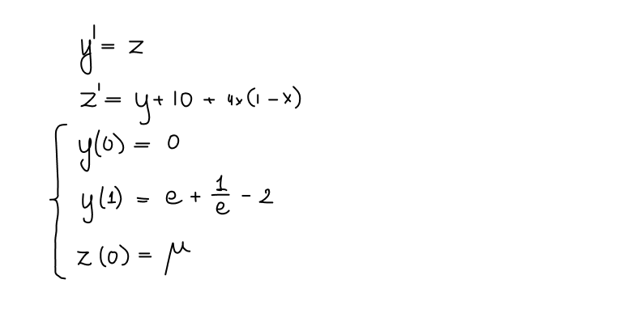
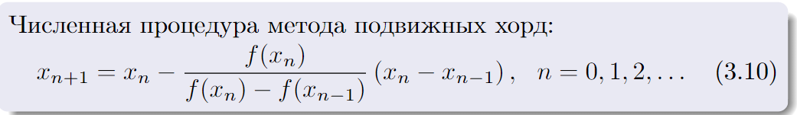
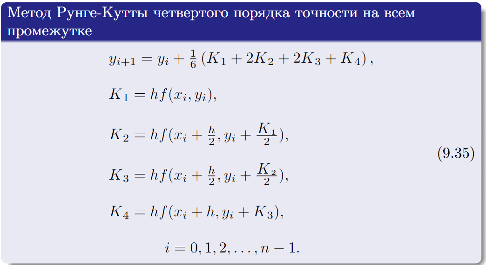
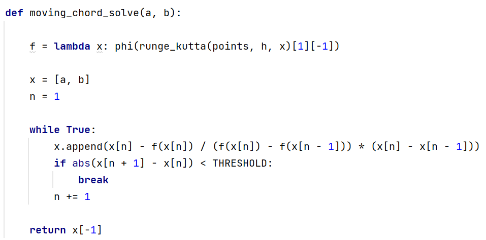

# Лабораторная работа 6

> Горбунов Миша, КН-401

## Вариант 20

Решаю такое уравнение:

- Методом **прогонки**
- Методом **стрельбы**
  - З.К решаю методом **Рунге-Кутты K=4**
  - Нелинейное ур-ние решаю методом **подвижных хорд**

## Точное решение

Для начала найдем точное решение уравнения 
-- далее будем сравнивать точное значение с получившимися численными решениями

## Решение методом стрельбы:

### Преобразуем исходное уравнение

### Комбинируем алгоритмы для решения З.К и нелинейного ур-ния:

## Решение методом прогонки:

TODO

## Сравнение методов