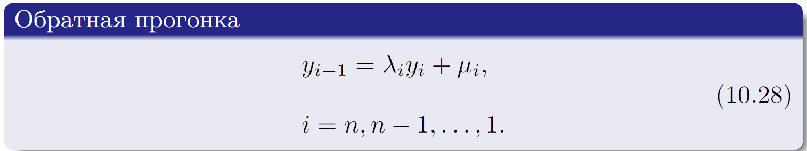
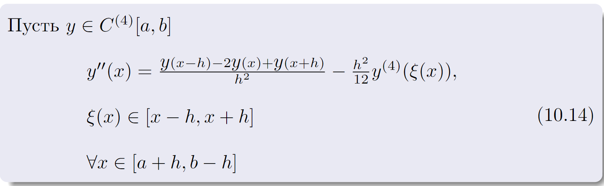
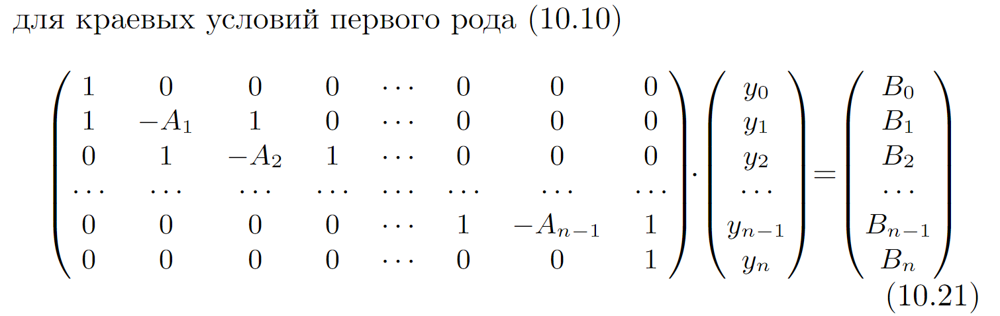
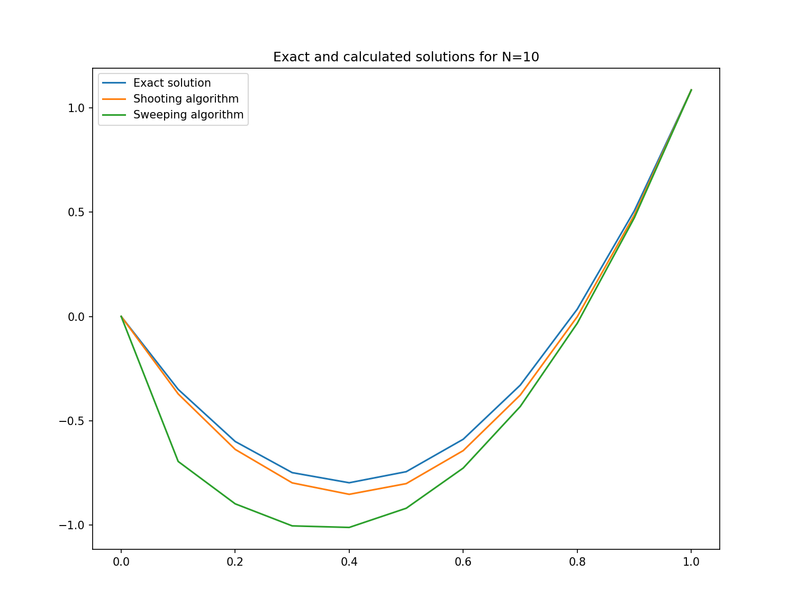
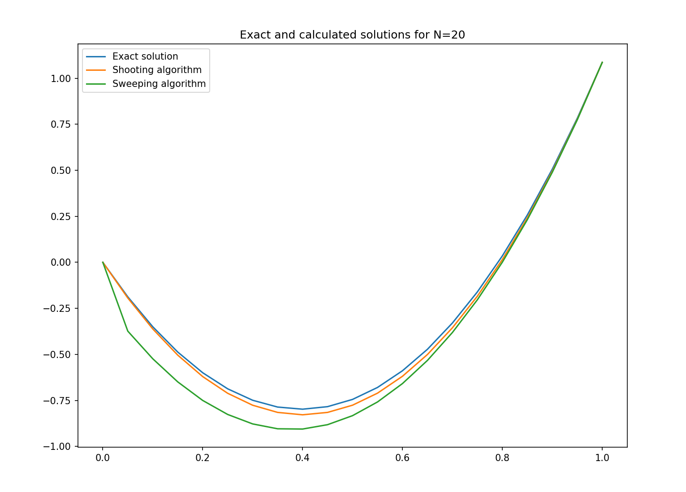

# Лабораторная работа 6

> Горбунов Миша, КН-401

## Вариант 20

Решаю такое уравнение:

- Методом **прогонки**
- Методом **стрельбы**
  - З.К решаю методом **Рунге-Кутты K=4**
  - Нелинейное ур-ние решаю методом **подвижных хорд**

## Точное решение

Для начала найдем точное решение уравнения 
-- далее будем сравнивать точное значение с получившимися численными решениями

## Решение методом стрельбы:

### Преобразуем исходное уравнение

### Комбинируем алгоритмы для решения З.К и нелинейного ур-ния:

## Решение методом прогонки:

> Рассуждения по диагональному преобраладнию приведены в коде.

## Сравнение методов

Метод прогонки сходится с `O(h^2)`, когда Метод Рунге-Кутты с K=4 имеет
порядок сходимости `O(h^4)`

Метод Рунге-Кутты формально сходится быстрее, но на практике работает чуть дольше.
Скорее всего это свяазано с тем, что на каждой итерации алгоритма приходится решать задачу Коши.